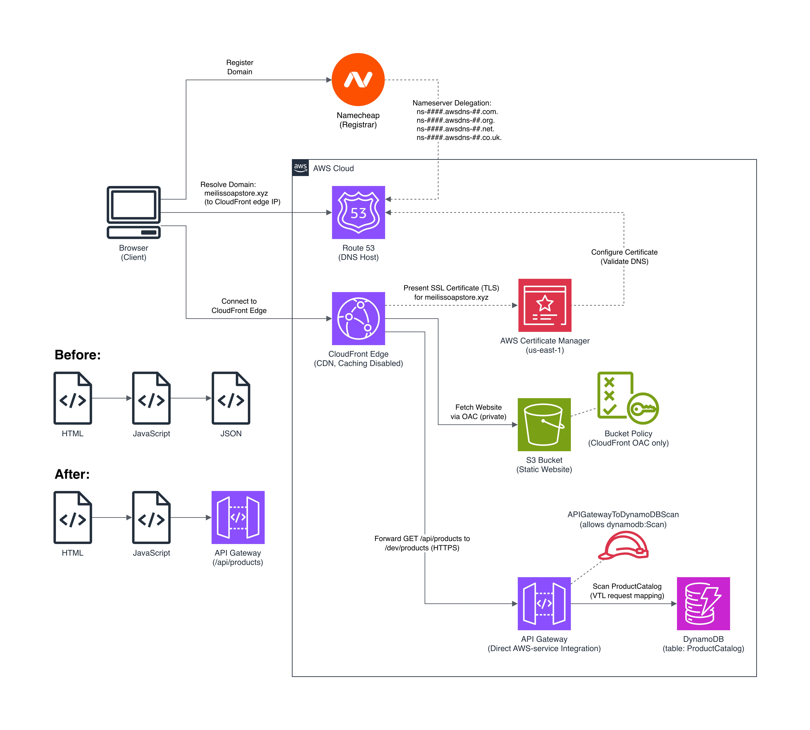
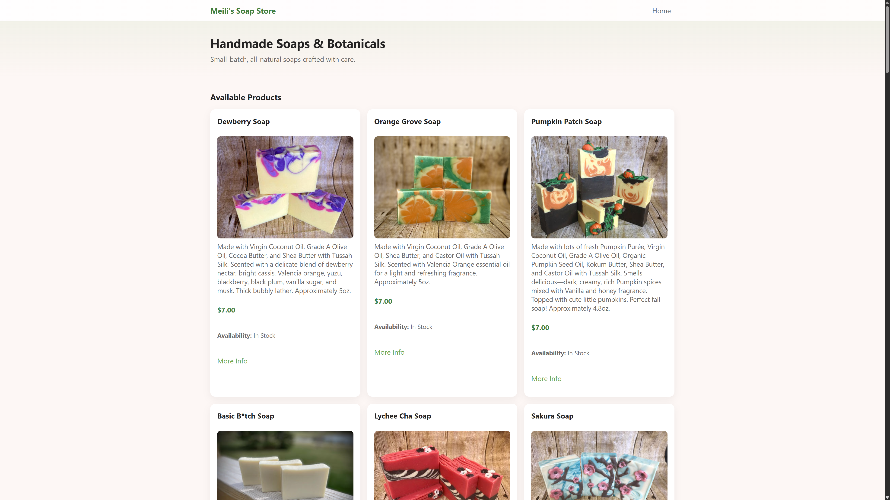
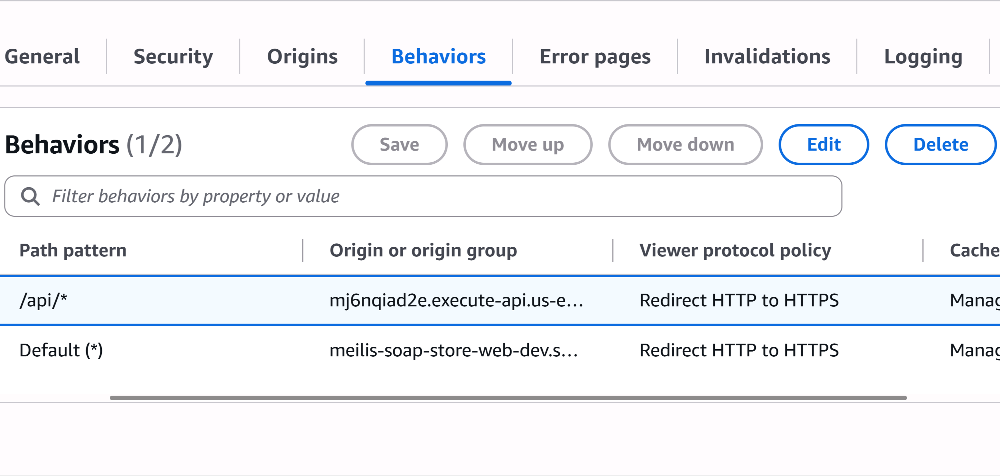
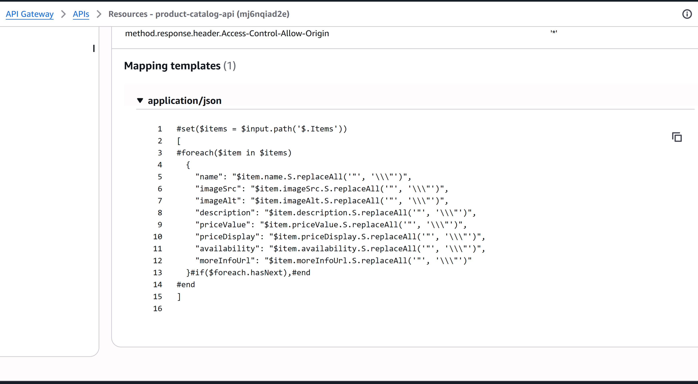
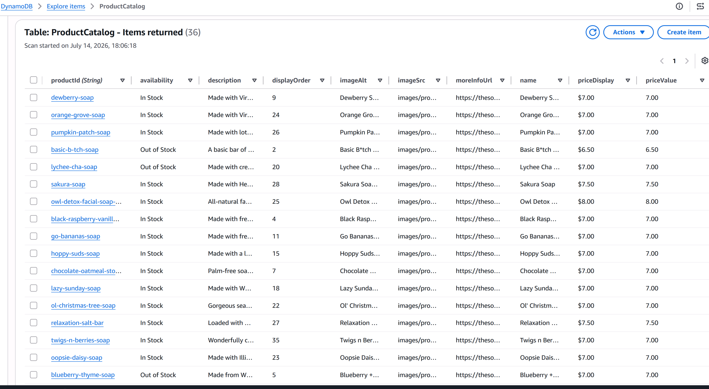

# Meili's Soap Store: API Gateway and DynamoDB Catalog Migration

This repository focuses on the latest backend update to [Meili's Soap Store](https://meilissoapstore.xyz/). The site originally loaded its product catalog from a static JSON file stored with the frontend. It now retrieves the same product data through CloudFront, API Gateway, and DynamoDB.

The visible website is intentionally unchanged. The goal of this update was to replace the static data source without requiring a major rewrite of the existing JavaScript.

**Live site:** [https://meilissoapstore.xyz/](https://meilissoapstore.xyz/)

<p align="center">
  
</p>

## What Changed

### Before

```text
HTML -> JavaScript -> Static JSON file
```

The browser downloaded a JSON file containing the full product catalog from the same S3-hosted frontend.

### After

```text
Browser
  -> CloudFront
      -> S3 for the website files
      -> API Gateway for /api/* requests
          -> DynamoDB ProductCatalog table
```

The JavaScript now requests `/api/products`. CloudFront uses a path-based behavior to route `/api/*` requests to API Gateway while continuing to serve the HTML, JavaScript, CSS, and images from the private S3 origin.

## Request Flow

1. The browser loads the website through CloudFront.
2. The frontend JavaScript sends a `GET` request to `/api/products`.
3. CloudFront matches the `/api/*` behavior and forwards the request to the API Gateway origin over HTTPS.
4. API Gateway uses a direct AWS service integration to scan the `ProductCatalog` DynamoDB table.
5. An IAM role grants API Gateway permission to perform `dynamodb:Scan` only on that table.
6. An API Gateway VTL response mapping template converts DynamoDB's typed response into the same JSON structure previously used by the frontend.
7. The existing JavaScript receives the familiar response shape and renders the product cards.

## Frontend Integration

The existing storefront rendering code was intentionally left mostly unchanged. The main frontend update was changing the default catalog URL in `ProductCatalogManager`:

```javascript
constructor(catalogUrl = '/api/products') {
```

Previously, the manager loaded the catalog from a static JSON file. It now sends the same request through the `/api/products` endpoint.

The frontend files included in this repository show the complete client-side flow:

- `app.js` initializes the catalog manager and product renderer.
- `product-catalog-manager.js` retrieves the catalog from `/api/products`.
- `product-list-renderer.js` renders the returned product data without needing to know whether it came from a static file or DynamoDB.

Because the API Gateway VTL response mapping preserves the original JSON structure, the existing product-rendering code did not need to be rewritten.

## Why Use a VTL Mapping Template?

DynamoDB returns values using its typed attribute format, such as strings wrapped in `S` properties. That response does not directly match the structure expected by the frontend.

The API Gateway response mapping template acts as an adapter by converting the DynamoDB response into the application's existing JSON contract before returning it to the browser.

This keeps the current read path serverless without adding a Lambda function between API Gateway and DynamoDB.

## Infrastructure as Code

The AWS infrastructure for this update is managed with OpenTofu, including:

- The DynamoDB `ProductCatalog` table
- API Gateway resources, methods, integrations, and deployment
- VTL request and response mapping templates
- The IAM role and table-specific permissions
- The CloudFront API Gateway origin
- The `/api/*` CloudFront cache behavior

Keeping these resources in OpenTofu makes the configuration version-controlled, reviewable, and reproducible instead of relying on manual console changes.

## Security and Access

- The S3 frontend remains private and is accessible through CloudFront Origin Access Control.
- CloudFront redirects browser requests from HTTP to HTTPS.
- Requests from CloudFront to API Gateway are sent over HTTPS.
- The API Gateway integration role is limited to `dynamodb:Scan` on the `ProductCatalog` table.
- The product endpoint is public because the catalog is intended to be readable by website visitors.

## Technologies Used

- JavaScript
- AWS S3
- Amazon CloudFront
- Amazon API Gateway
- Amazon DynamoDB
- AWS IAM
- Amazon Route 53
- AWS Certificate Manager
- AWS WAF
- OpenTofu
- Velocity Template Language (VTL)

## Current Design Notes

The catalog currently contains a small number of products, so a DynamoDB `Scan` keeps the demo straightforward. For a larger catalog, the data model and access pattern could be updated to use `Query`, indexes, pagination, and caching rather than scanning the entire table for every request.

## Screenshots

<p align="center">
  
</p>

<details>
<summary>Additional implementation screenshots</summary>

### CloudFront path-based routing



### API Gateway VTL response mapping



### DynamoDB product catalog



</details>